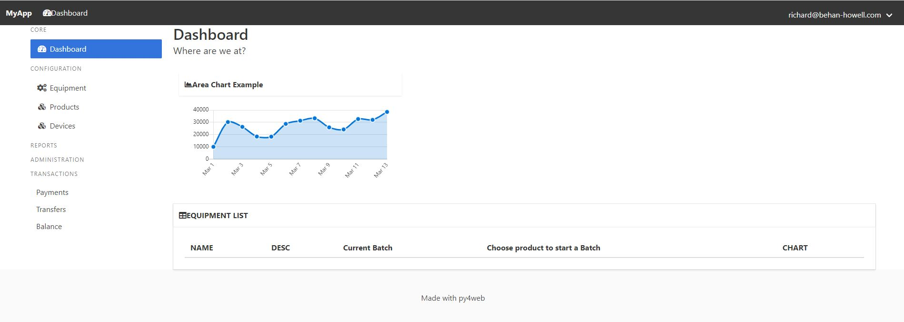
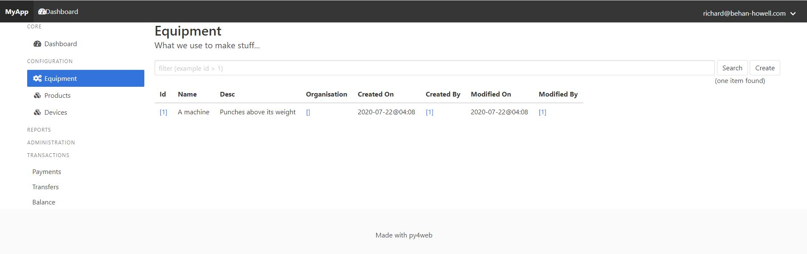

# py4web_admin_template
An Admin style app template for Py4Web

This is simply an example app for [Py4Web](https://py4web.com/) by Massimo Di Pierro and co

Read more here: https://github.com/web2py/py4web

This is based off the examples app, but with a sidebar menu.

TODO:
1. Multi Tenant capability
2. Administration of users
3. ...

